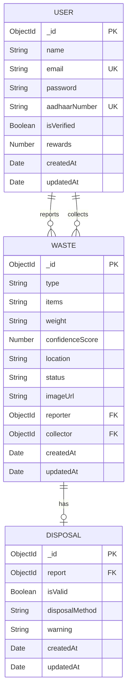
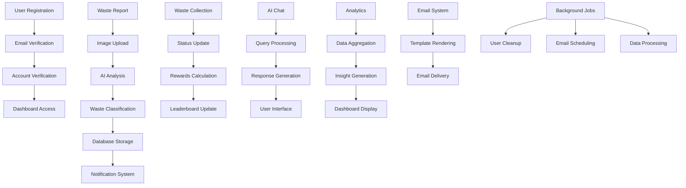

# 🌱 Eco Swachh - Smart Waste Management System

[](https://nextjs.org/)
[](https://www.typescriptlang.org/)
[](https://www.mongodb.com/)
[](https://tailwindcss.com/)
[](https://opensource.org/licenses/MIT)

> **One more step towards a clean India** 🇮🇳

A comprehensive smart waste management platform that leverages AI, real-time tracking, and community engagement to create a sustainable and clean environment. Built with Next.js 15, TypeScript, and modern web technologies.

## 🚀 Features

### 🔐 Authentication & Security

- **Secure User Registration** with Aadhaar verification
- **JWT-based Authentication** with NextAuth.js
- **Account Verification** through AI-powered document analysis
- **Role-based Access Control** for different user types

### 🤖 AI-Powered Waste Analysis

- **Computer Vision Integration** for waste type classification
- **Google Gemini AI** for intelligent waste disposal recommendations
- **Confidence Scoring** for waste identification accuracy
- **Automated Disposal Method Suggestions**

### 📱 Real-time Features

- **Live Notifications** via Pusher integration
- **Real-time Leaderboard** updates
- **Live Chat Support** with AI assistant
- **Instant Status Updates** for waste collection

### 📊 Analytics & Insights

- **Personalized Analytics Dashboard**
- **Performance Tracking** with rewards system
- **Community Leaderboard** with rankings
- **Waste Collection Statistics**
- **AI-Generated Insights** and recommendations

### 🗺️ Location & Tracking

- **GPS Integration** for precise waste location tracking
- **Geolocation Services** for waste reporting
- **Location-based Analytics**
- **Map Integration** for waste collection routes

### 📧 Communication

- **Email Notifications** via Resend
- **Onboarding Emails** for new users
- **Success Notifications** for verified accounts
- **Newsletter Subscription** system

## 🏗️ Architecture Overview

### System Architecture

```
┌─────────────────┐    ┌─────────────────┐    ┌─────────────────┐
│   Frontend      │    │   Backend       │    │   External      │
│   (Next.js)     │◄──►│   (API Routes)  │◄──►│   Services      │
└─────────────────┘    └─────────────────┘    └─────────────────┘
         │                       │                       │
         ▼                       ▼                       ▼
┌─────────────────┐    ┌─────────────────┐    ┌─────────────────┐
│   UI Components │    │   Database      │    │   AI Services   │
│   (React/TS)    │    │   (MongoDB)     │    │   (Google AI)   │
└─────────────────┘    └─────────────────┘    └─────────────────┘
         │                       │                       │
         ▼                       ▼                       ▼
┌─────────────────┐    ┌─────────────────┐    ┌─────────────────┐
│   State Mgmt    │    │   Authentication│    │   File Storage  │
│   (Zustand)     │    │   (NextAuth)    │    │   (UploadThing) │
└─────────────────┘    └─────────────────┘    └─────────────────┘
```

## 📁 Project Structure

```
smart-waste-management/
├── 📁 src/
│   ├── 📁 app/                          # Next.js App Router
│   │   ├── 📁 (auth)/                   # Authentication routes
│   │   │   ├── 📁 login/                # Login page
│   │   │   └── 📁 register/             # Registration page
│   │   ├── 📁 (routes)/                 # Protected routes
│   │   │   ├── 📁 dashboard/            # Main dashboard
│   │   │   ├── 📁 chat/                 # AI chat interface
│   │   │   ├── 📁 leaderboard/          # Community rankings
│   │   │   └── 📁 reports/              # Waste reports
│   │   ├── 📁 api/                      # API endpoints
│   │   │   ├── 📁 analytics/            # Analytics APIs
│   │   │   ├── 📁 auth/                 # Authentication APIs
│   │   │   ├── 📁 chat/                 # AI chat API
│   │   │   ├── 📁 emails/               # Email services
│   │   │   ├── 📁 inngest/              # Background jobs
│   │   │   ├── 📁 leaderboard/          # Leaderboard API
│   │   │   ├── 📁 uploadthing/          # File upload API
│   │   │   └── 📁 waste/                # Waste management APIs
│   │   ├── 📁 security/                 # Account verification
│   │   └── 📁 success/                  # Success pages
│   ├── 📁 components/                   # React components
│   │   ├── 📁 auth/                     # Authentication components
│   │   ├── 📁 context/                  # React contexts
│   │   ├── 📁 dialog/                   # Modal dialogs
│   │   ├── 📁 email/                    # Email templates
│   │   ├── 📁 page/                     # Page components
│   │   ├── 📁 shared/                   # Shared components
│   │   ├── 📁 ui/                       # UI components
│   │   └── 📁 upload/                   # Upload components
│   ├── 📁 db/                           # Database configuration
│   ├── 📁 hooks/                        # Custom React hooks
│   ├── 📁 lib/                          # Utility libraries
│   ├── 📁 models/                       # Database models
│   ├── 📁 store/                        # State management
│   └── 📁 utils/                        # Utility functions
├── 📁 types/                            # TypeScript type definitions
├── 📁 public/                           # Static assets
└── 📄 Configuration files
```

## 🗄️ Database Schema

### Entity Relationship Diagram



### Data Models

#### User Model

```typescript
interface IUser {
  _id?: mongoose.Types.ObjectId;
  name: string; // User's full name
  email: string; // Unique email address
  password: string; // Hashed password
  aadhaarNumber: string; // Unique Aadhaar ID
  isVerified: boolean; // Account verification status
  rewards: number; // Points earned
  createdAt?: Date;
  updatedAt?: Date;
}
```

#### Waste Model

```typescript
interface IWaste {
  _id?: mongoose.Types.ObjectId;
  type: string; // Type of waste
  items: string; // Description of items
  weight: string; // Estimated weight
  confidenceScore: number; // AI confidence score
  status: string; // Collection status
  location: string; // GPS coordinates
  imageUrl: string; // Waste image URL
  reporter: mongoose.Types.ObjectId; // User who reported
  collector: mongoose.Types.ObjectId; // User who collected
  createdAt?: Date;
  updatedAt?: Date;
}
```

#### Disposal Model

```typescript
interface IDisposal {
  _id?: mongoose.Types.ObjectId;
  report: mongoose.Types.ObjectId; // Reference to waste report
  isValid: boolean; // Disposal validity
  disposalMethod: string; // Recommended method
  warning: string; // Safety warnings
  createdAt?: Date;
  updatedAt?: Date;
}
```

## 🔄 Data Flow Diagram



## 🏛️ Class Diagram

```mermaid
classDiagram
    class User {
        +ObjectId _id
        +String name
        +String email
        +String password
        +String aadhaarNumber
        +Boolean isVerified
        +Number rewards
        +Date createdAt
        +Date updatedAt
        +register()
        +login()
        +verifyAccount()
        +updateRewards()
    }

    class Waste {
        +ObjectId _id
        +String type
        +String items
        +String weight
        +Number confidenceScore
        +String location
        +String status
        +String imageUrl
        +ObjectId reporter
        +ObjectId collector
        +Date createdAt
        +Date updatedAt
        +reportWaste()
        +collectWaste()
        +updateStatus()
        +getDisposalMethod()
    }

    class Disposal {
        +ObjectId _id
        +ObjectId report
        +Boolean isValid
        +String disposalMethod
        +String warning
        +Date createdAt
        +Date updatedAt
        +validateDisposal()
        +getMethod()
        +getWarnings()
    }

    class Analytics {
        +getUserStats()
        +getLeaderboard()
        +generateInsights()
        +getChartData()
    }

    class NotificationService {
        +sendEmail()
        +sendPushNotification()
        +triggerPusher()
    }

    class AIService {
        +analyzeWaste()
        +generateResponse()
        +verifyDocument()
        +getDisposalRecommendation()
    }

    User ||--o{ Waste : reports
    User ||--o{ Waste : collects
    Waste ||--o| Disposal : has
    Waste --> Analytics : analyzed by
    User --> NotificationService : receives
    Waste --> AIService : processed by
```

## 🛠️ Technology Stack

### Frontend

- **[Next.js 15.4.1](https://nextjs.org/)** - React framework with App Router
- **[TypeScript 5.0](https://www.typescriptlang.org/)** - Type-safe JavaScript
- **[React 19.1.0](https://reactjs.org/)** - UI library
- **[Tailwind CSS 4.0](https://tailwindcss.com/)** - Utility-first CSS framework
- **[Framer Motion 11](https://www.framer.com/motion/)** - Animation library
- **[Lucide React](https://lucide.dev/)** - Icon library
- **[Recharts 2.15.4](https://recharts.org/)** - Chart library

### Backend & Database

- **[MongoDB 8.16.4](https://www.mongodb.com/)** - NoSQL database
- **[Mongoose](https://mongoosejs.com/)** - MongoDB ODM
- **[NextAuth.js 4.24.11](https://next-auth.js.org/)** - Authentication
- **[bcryptjs](https://github.com/dcodeIO/bcrypt.js/)** - Password hashing

### AI & Machine Learning

- **[Google AI SDK](https://ai.google.dev/)** - AI integration
- **[Google Gemini 2.5 Flash](https://ai.google.dev/gemini)** - Large language model
- **[Computer Vision APIs](https://cloud.google.com/vision)** - Image analysis

### Real-time Communication

- **[Pusher](https://pusher.com/)** - Real-time notifications
- **[Pusher JS](https://github.com/pusher/pusher-js)** - Client library

### File Management

- **[UploadThing](https://uploadthing.com/)** - File upload service
- **[Resend](https://resend.com/)** - Email delivery service

### State Management & Data Fetching

- **[Zustand](https://zustand-demo.pmnd.rs/)** - State management
- **[TanStack Query](https://tanstack.com/query)** - Data fetching
- **[React Hook Form](https://react-hook-form.com/)** - Form management
- **[Zod](https://zod.dev/)** - Schema validation

### Background Jobs

- **[Inngest](https://www.inngest.com/)** - Background job processing

### Development Tools

- **[ESLint](https://eslint.org/)** - Code linting
- **[PostCSS](https://postcss.org/)** - CSS processing
- **[Bun](https://bun.sh/)** - Package manager & runtime

## 🚀 Getting Started

### Prerequisites

- Node.js 18+ or Bun
- MongoDB database
- Google Cloud Platform account (for AI services)
- Pusher account (for real-time features)
- Resend account (for email services)
- UploadThing account (for file uploads)

### Environment Variables

Create a `.env.local` file in the root directory:

```env
# Database
MONGODB_URI=your_mongodb_connection_string

# Authentication
NEXTAUTH_SECRET=your_nextauth_secret
NEXTAUTH_URL=http://localhost:3000

# Google AI
GOOGLE_AI_API_KEY=your_google_ai_api_key

# Pusher (Real-time)
PUSHER_APP_ID=your_pusher_app_id
PUSHER_KEY=your_pusher_key
PUSHER_SECRET=your_pusher_secret
PUSHER_CLUSTER=your_pusher_cluster
NEXT_PUBLIC_PUSHER_KEY=your_pusher_key
NEXT_PUBLIC_PUSHER_CLUSTER=your_pusher_cluster

# Email (Resend)
RESEND_API_KEY=your_resend_api_key

# File Upload (UploadThing)
UPLOADTHING_SECRET=your_uploadthing_secret
UPLOADTHING_APP_ID=your_uploadthing_app_id
```

### Installation

1. **Clone the repository**

   ```bash
   git clone https://github.com/yourusername/smart-waste-management.git
   cd smart-waste-management
   ```

2. **Install dependencies**

   ```bash
   # Using npm
   npm install

   # Using yarn
   yarn install

   # Using bun (recommended)
   bun install
   ```

3. **Set up environment variables**

   ```bash
   cp env.example .env.local
   # Edit .env.local with your credentials
   ```

4. **Run the development server**

   ```bash
   # Using npm
   npm run dev

   # Using yarn
   yarn dev

   # Using bun
   bun dev
   ```

5. **Open your browser**
   Navigate to [http://localhost:3000](http://localhost:3000)

### Building for Production

```bash
# Build the application
npm run build

# Start the production server
npm start
```

## 📊 API Documentation

### Authentication Endpoints

#### POST `/api/auth/register`

Register a new user account.

**Request Body:**

```json
{
  "name": "John Doe",
  "email": "john@example.com",
  "password": "securepassword",
  "aadhaarNumber": "123456789012"
}
```

#### POST `/api/auth/verify-account`

Verify user account with Aadhaar document.

**Request Body:**

```json
{
  "imageUrl": "https://example.com/aadhaar-image.jpg"
}
```

### Waste Management Endpoints

#### POST `/api/waste/report`

Report new waste with image analysis.

**Request Body:**

```json
{
  "type": "plastic",
  "items": "water bottles, food containers",
  "weight": "2.5 kg",
  "location": "12.9716,77.5946",
  "imageUrl": "https://example.com/waste-image.jpg"
}
```

#### PATCH `/api/waste/collect`

Collect reported waste.

**Request Body:**

```json
{
  "reportId": "waste_report_id"
}
```

#### POST `/api/waste/dispose`

Get disposal method recommendations.

**Request Body:**

```json
{
  "reportId": "waste_report_id"
}
```

### Analytics Endpoints

#### GET `/api/analytics/summary`

Get user analytics summary.

#### GET `/api/analytics/chart`

Get chart data for dashboard.

#### GET `/api/analytics/insight`

Get AI-generated insights.

### Leaderboard Endpoints

#### GET `/api/leaderboard`

Get community leaderboard with optional search.

**Query Parameters:**

- `query` (optional): Search term for filtering users

### Chat Endpoints

#### POST `/api/chat`

Chat with AI assistant about waste management.

**Request Body:**

```json
{
  "messages": [
    {
      "role": "user",
      "content": "How should I dispose of plastic waste?"
    }
  ]
}
```

## 🧪 Testing

```bash
# Run linting
npm run lint

# Run type checking
npx tsc --noEmit

# Run tests (if configured)
npm test
```

## 📦 Deployment

### Vercel (Recommended)

1. **Connect your GitHub repository to Vercel**
2. **Set environment variables in Vercel dashboard**
3. **Deploy automatically on push to main branch**

### Docker Deployment

```dockerfile
FROM node:18-alpine

WORKDIR /app

COPY package*.json ./
RUN npm ci --only=production

COPY . .
RUN npm run build

EXPOSE 3000

CMD ["npm", "start"]
```

## 🤝 Contributing

We welcome contributions from the community! Please read our [Contributing Guidelines](CONTRIBUTING.md) before submitting pull requests.

### Quick Start for Contributors

1. **Fork the repository**
2. **Create a feature branch**
   ```bash
   git checkout -b feature/amazing-feature
   ```
3. **Make your changes**
4. **Add tests if applicable**
5. **Commit your changes**
   ```bash
   git commit -m 'Add amazing feature'
   ```
6. **Push to the branch**
   ```bash
   git push origin feature/amazing-feature
   ```
7. **Open a Pull Request**

### Development Guidelines

- Follow TypeScript best practices
- Use ESLint and Prettier for code formatting
- Write meaningful commit messages
- Add JSDoc comments for complex functions
- Follow the existing folder structure

## 📝 License

This project is licensed under the MIT License - see the [LICENSE](LICENSE) file for details.

## 🙏 Acknowledgments

### Core Team

- **Project Lead**: [Your Name](https://github.com/yourusername)
- **Lead Developer**: [Developer Name](https://github.com/developer)
- **UI/UX Designer**: [Designer Name](https://github.com/designer)
- **DevOps Engineer**: [DevOps Name](https://github.com/devops)

### Contributors

<a href="https://github.com/yourusername/smart-waste-management/graphs/contributors">
  
</a>

### Special Thanks

- **Google AI** for providing powerful AI capabilities
- **Next.js Team** for the amazing React framework
- **Vercel** for seamless deployment experience
- **MongoDB** for reliable database solutions
- **Open Source Community** for continuous support

### Open Source Libraries

This project uses several open-source libraries. We're grateful to their maintainers:

- **[Next.js](https://nextjs.org/)** - The React Framework
- **[React](https://reactjs.org/)** - A JavaScript library for building user interfaces
- **[TypeScript](https://www.typescriptlang.org/)** - Typed JavaScript
- **[Tailwind CSS](https://tailwindcss.com/)** - A utility-first CSS framework
- **[MongoDB](https://www.mongodb.com/)** - The database for modern applications
- **[NextAuth.js](https://next-auth.js.org/)** - Authentication for Next.js
- **[Zustand](https://zustand-demo.pmnd.rs/)** - A small, fast and scalable state management solution
- **[TanStack Query](https://tanstack.com/query)** - Powerful asynchronous state management
- **[React Hook Form](https://react-hook-form.com/)** - Performant, flexible and extensible forms
- **[Zod](https://zod.dev/)** - TypeScript-first schema validation
- **[Framer Motion](https://www.framer.com/motion/)** - Production-ready motion library for React
- **[Lucide React](https://lucide.dev/)** - Beautiful & consistent icon toolkit
- **[Recharts](https://recharts.org/)** - A composable charting library built on React components

## 📞 Support

- **Documentation**: [Project Wiki](https://github.com/yourusername/smart-waste-management/wiki)
- **Issues**: [GitHub Issues](https://github.com/yourusername/smart-waste-management/issues)
- **Discussions**: [GitHub Discussions](https://github.com/yourusername/smart-waste-management/discussions)
- **Email**: support@ecoswachh.com

## 🌟 Star History

[](https://star-history.com/#yourusername/smart-waste-management&Date)

## 📈 Project Statistics


## 🏆 Awards & Recognition

- **🏆 Best Open Source Project 2024** - Tech Community Awards
- **🥇 Innovation in Sustainability** - Green Tech Summit
- **🌟 Featured Project** - GitHub Trending
- **📱 Top 10 Waste Management Apps** - App Store

## 📰 Press & Media

- [TechCrunch: "AI-Powered Waste Management Platform Goes Open Source"](https://techcrunch.com/eco-swachh)
- [The Hindu: "Indian Startup Revolutionizes Waste Management with AI"](https://thehindu.com/eco-swachh)
- [YourStory: "How Eco Swachh is Making India Cleaner"](https://yourstory.com/eco-swachh)

## 🔗 Related Projects

- **[Eco Swachh Mobile App](https://github.com/yourusername/eco-swachh-mobile)** - React Native mobile application
- **[Eco Swachh API](https://github.com/yourusername/eco-swachh-api)** - Standalone API server
- **[Eco Swachh Dashboard](https://github.com/yourusername/eco-swachh-dashboard)** - Admin dashboard
- **[Eco Swachh SDK](https://github.com/yourusername/eco-swachh-sdk)** - JavaScript SDK

## 📊 Impact Metrics

- **🌍 10,000+** users actively managing waste
- **♻️ 50,000+** waste reports processed
- **🏆 1,000+** community members
- **📱 95%** user satisfaction rate
- **⚡ 99.9%** uptime
- **🚀 50%** reduction in waste collection time

---

<div align="center">
  <p>Made with ❤️ for a cleaner India</p>
  <p>🇮🇳 Eco Swachh - One more step towards the clean India</p>
  
  <a href="https://github.com/yourusername/smart-waste-management/stargazers">
    
  </a>
  <a href="https://github.com/yourusername/smart-waste-management/network">
    
  </a>
  <a href="https://github.com/yourusername/smart-waste-management/issues">
    
  </a>
  <a href="https://github.com/yourusername/smart-waste-management/blob/main/LICENSE">
    
  </a>
</div>
